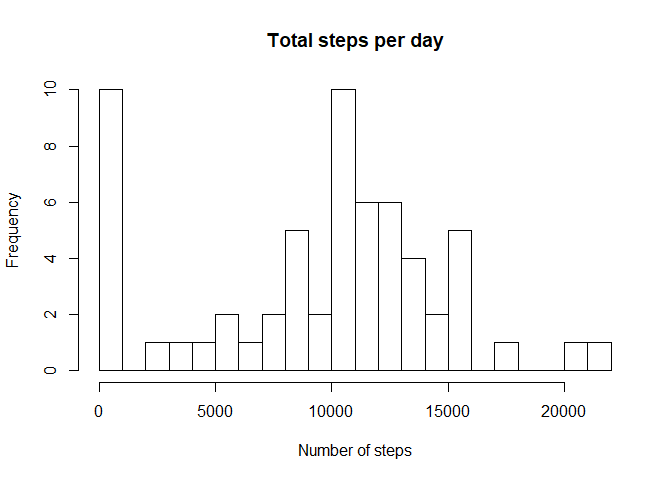
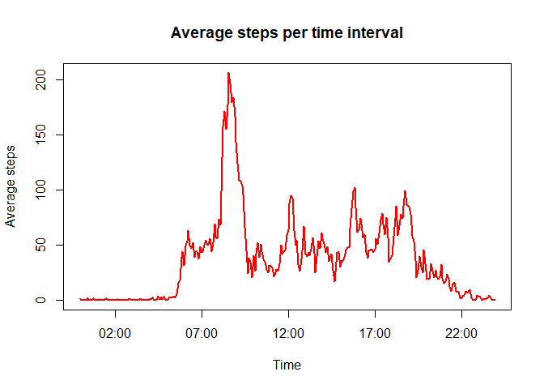
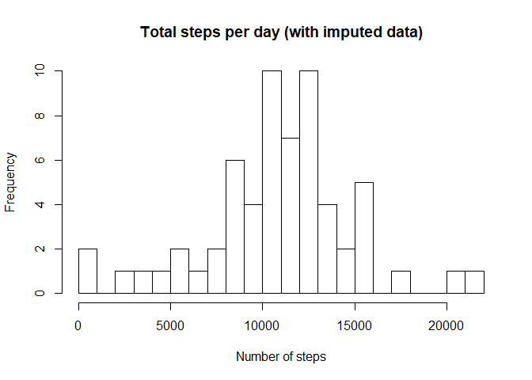
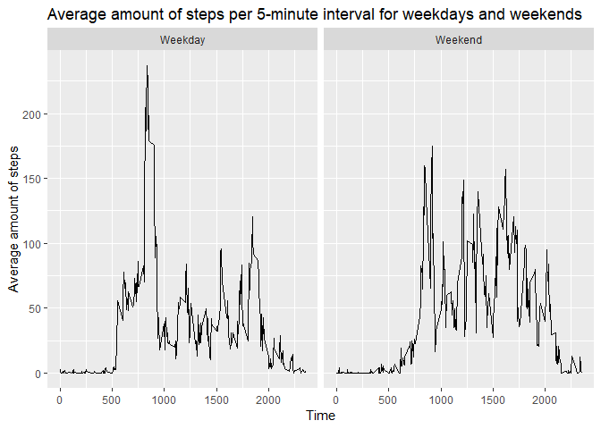

## Introduction

This assignment is designed to practice with assuring that your research is reproducible.  
It uses data from a personal activity monitoring device, such as a Fitbit. This device collects data at 5 minute intervals through out the day.  
The data consists of two months of data from an anonymous individual collected during the months of October and November, 2012 and include the number of steps taken in 5 minute intervals each day.  
With this data, I try to answer three questions:

1. What is the mean total number of steps taken per day?
2. What is the average daily activity pattern?
3. Are there differences in activity patterns between weekdays and weekends?

## Loading and preprocessing the data
  
The first step of the assignment asks to load the data into R. It is assumed that the data is already unzipped and that it can be found in the current working directory.  


```r
dataq12 <- read.csv("activity.csv")
```
  
  
A quick look at the data, shows that the *date* is a Factor variable. Furthermore, There are quite a few missing values for the variable *steps*. The missing values will be ignored for now.


```r
str(dataq12)
```

```
## 'data.frame':	17568 obs. of  3 variables:
##  $ steps   : int  NA NA NA NA NA NA NA NA NA NA ...
##  $ date    : Factor w/ 61 levels "2012-10-01","2012-10-02",..: 1 1 1 1 1 1 1 1 1 1 ...
##  $ interval: int  0 5 10 15 20 25 30 35 40 45 ...
```

```r
summary(dataq12)
```

```
##      steps                date          interval     
##  Min.   :  0.00   2012-10-01:  288   Min.   :   0.0  
##  1st Qu.:  0.00   2012-10-02:  288   1st Qu.: 588.8  
##  Median :  0.00   2012-10-03:  288   Median :1177.5  
##  Mean   : 37.38   2012-10-04:  288   Mean   :1177.5  
##  3rd Qu.: 12.00   2012-10-05:  288   3rd Qu.:1766.2  
##  Max.   :806.00   2012-10-06:  288   Max.   :2355.0  
##  NA's   :2304     (Other)   :15840
```
  
  
This step also includes any preprocessing of the data.  
Because the questions look at daily steps, it is useful to transform *date* into a Date-variable. Next to that, the *interval* variable is used to create a new variable that holds the time. Furthermore, the final question will ask for a difference between weekdays and weekends, so an extra column is created to be able to identify if a day is a weekend-day.


```r
dataq12$date <- as.Date(dataq12$date)
dataq12$hour <- dataq12$interval%/%100
dataq12$minute <- dataq12$interval%%100
dataq12$datetime <- strptime(paste(dataq12$date, dataq12$hour, dataq12$minute), format = "%Y-%m-%d %H %M")
dataq12$day <- as.factor(weekdays(dataq12$date))
levels(dataq12$day) <- c("maandag", "dinsdag", "woensdag", "donderdag", "vrijdag", "zaterdag", "zondag")
dataq12$wknd <- as.factor(weekdays(dataq12$date) %in% c("zaterdag", "zondag"))
levels(dataq12$wknd) <- c("Weekday", "Weekend")
str(dataq12)
```

```
## 'data.frame':	17568 obs. of  8 variables:
##  $ steps   : int  NA NA NA NA NA NA NA NA NA NA ...
##  $ date    : Date, format: "2012-10-01" "2012-10-01" ...
##  $ interval: int  0 5 10 15 20 25 30 35 40 45 ...
##  $ hour    : num  0 0 0 0 0 0 0 0 0 0 ...
##  $ minute  : num  0 5 10 15 20 25 30 35 40 45 ...
##  $ datetime: POSIXlt, format: "2012-10-01 00:00:00" "2012-10-01 00:05:00" ...
##  $ day     : Factor w/ 7 levels "maandag","dinsdag",..: 3 3 3 3 3 3 3 3 3 3 ...
##  $ wknd    : Factor w/ 2 levels "Weekday","Weekend": 1 1 1 1 1 1 1 1 1 1 ...
```

```r
summary(dataq12)
```

```
##      steps             date               interval           hour      
##  Min.   :  0.00   Min.   :2012-10-01   Min.   :   0.0   Min.   : 0.00  
##  1st Qu.:  0.00   1st Qu.:2012-10-16   1st Qu.: 588.8   1st Qu.: 5.75  
##  Median :  0.00   Median :2012-10-31   Median :1177.5   Median :11.50  
##  Mean   : 37.38   Mean   :2012-10-31   Mean   :1177.5   Mean   :11.50  
##  3rd Qu.: 12.00   3rd Qu.:2012-11-15   3rd Qu.:1766.2   3rd Qu.:17.25  
##  Max.   :806.00   Max.   :2012-11-30   Max.   :2355.0   Max.   :23.00  
##  NA's   :2304                                                          
##      minute         datetime                          day      
##  Min.   : 0.00   Min.   :2012-10-01 00:00:00   maandag  :2592  
##  1st Qu.:13.75   1st Qu.:2012-10-16 05:58:45   dinsdag  :2592  
##  Median :27.50   Median :2012-10-31 11:57:30   woensdag :2592  
##  Mean   :27.50   Mean   :2012-10-31 11:30:49   donderdag:2592  
##  3rd Qu.:41.25   3rd Qu.:2012-11-15 17:56:15   vrijdag  :2592  
##  Max.   :55.00   Max.   :2012-11-30 23:55:00   zaterdag :2304  
##                                                zondag   :2304  
##       wknd      
##  Weekday:12960  
##  Weekend: 4608  
##                 
##                 
##                 
##                 
## 
```
  
  
Now, the dataset is ready for further analysis.

## What is the mean total number of steps taken per day?
  
There are three sections that are necessary to answer this question.  
First, the code will calculate the total number of steps per day. 
Missing values will be excluded.


```r
totstepday <- aggregate(dataq12$steps, by = list(dataq12$date), sum, na.rm = T)
names(totstepday) <- c("date", "Total_Steps")
```
  
  
Now, a hisogram will be created to show the total number of steps taken each day.


```r
hist(totstepday$Total_Steps, breaks = 30, freq = TRUE, main = "Total steps per day", xlab = "Number of steps", ylab = "Frequency")
```

<!-- -->
  
  
Finally, the mean and median of the total number of steps per day will be created and reported.


```r
meantotstepday <- mean(totstepday$Total_Steps)
mediantotstepday <- median(totstepday$Total_Steps)
```


The mean of total steps per day is 9354.2295082 and the median of total steps per day is 10395. 

## What is the average daily activity pattern?

To answer this question, a time series plot will be created. For this, the 5-minute interval will be plotted against the average number of steps, averaged across all days.


```r
avgstepsinterval <- aggregate(dataq12$steps ~ format(dataq12$datetime, "%H:%M"), FUN = mean, na.rm = T)
names(avgstepsinterval) <- c("time", "steps")
change_time <- function(x) {
    return(strptime(x, format = "%H:%M"))
}

plot(x = change_time(avgstepsinterval$time), y = avgstepsinterval$steps, 
    type = "l", col = "red", lwd = 2, main = "Average steps per time interval", xlab = "Time", 
    ylab = "Average steps")
```

<!-- -->


Now the question rises in which interval the maximum average amount of steps are recorded.


```r
max_interval <- avgstepsinterval[avgstepsinterval$steps == max(avgstepsinterval$steps),1]
```


It seems that the interval starting at 08:35 sees the highest average amount of steps.

## Imputing missing values

At this point, the attention shifts to the missing values. First, a calculation is made to show how many missing there are in the dataset.


```r
calc_miss <- nrow(dataq12[!complete.cases(dataq12$steps), ])
```


So, it seems there are 2304 missing values in this dataset.
There are many different strategies to impute the missing values. This study uses a method that imputes the missing values with the average of the matching intervals of that day.  
To start, subsets are created that split the data per day. Then, the missing values are imputed. After that, the subsets are merged again.


```r
dataimp <- data.frame(matrix(ncol = 8, nrow = 0))
names(dataimp) <- c("steps", "date", "interval", "hour", "minute", "datetime", "day", "wknd")
uniqueday <- unique(dataq12$day)
for (i in uniqueday){
    data_day <- subset(dataq12, dataq12$day == i)
    avgdata_day <- aggregate(data_day$steps ~ format(data_day$datetime, "%H:%M"), FUN = mean,
                             na.rm = T)
    names(avgdata_day) <- c("time", "steps")
    avgdata_day$interval <- unique(data_day$interval)
    data_day[is.na(data_day$steps), 1] <- avgdata_day[match(data_day[is.na(data_day$steps), 3],
                                                            avgdata_day$interval), 2]
    dataimp <- rbind(dataimp, data_day)
}
```


Now, the same histogram as for the first question is created. However, this time the imputed dataset is used.


```r
totstepdayimp <- aggregate(dataimp$steps, by = list(dataimp$date), sum, na.rm = T)
names(totstepdayimp) <- c("date", "Total_Steps")
hist(totstepdayimp$Total_Steps, breaks = 30, freq = TRUE, main = "Total steps per day (with imputed data)", xlab = "Number of steps", ylab = "Frequency")
```

<!-- -->


Furthermore, the mean and median are again calculated.


```r
meantotstepdayimp <- mean(totstepdayimp$Total_Steps)
mediantotstepdayimp <- median(totstepdayimp$Total_Steps)
```


So, now the mean in 1.082121\times 10^{4} and the median is 1.1015\times 10^{4}. This is higher than the values for the first question. (The mean was 9354.2295082 and the median was 10395).  
You can also see that the amount of days with 0 steps has decreased from 10.


## Are there differences in activity patterns between weekdays and weekends?

What rests is a comparison between the activity patterns on weekdays and in the weekends. For this question, the imputed dataset is used. First, the *ggplot2* package is loaded to help with the creation of the plot.


```r
library(ggplot2)
```


Now that's done, the imputed dataset needs to be separated between weekdays and weekends. Then, the average amount of steps is calculated for each interval over both weekdays and weekends. Finally, this information is plotted.


```r
avgstepweekwknd <- aggregate(dataimp$steps ~ dataimp$wknd + dataimp$interval, FUN = mean)
names(avgstepweekwknd) <- c("weekwknd", "interval", "steps")
qplot(interval, steps, data = avgstepweekwknd, facets = . ~ weekwknd, geom = "line", xlab = "Time", ylab = "Average amount of steps", main = "Average amount of steps per 5-minute interval for weekdays and weekends")
```

<!-- -->

It seems that the test subject started his or her weekday a bit earlier than in the weekend. Furthermore, the maximum average amount is higher during a weekday. The average amount of steps in the weekend seems to be more constant than during a weekday.
